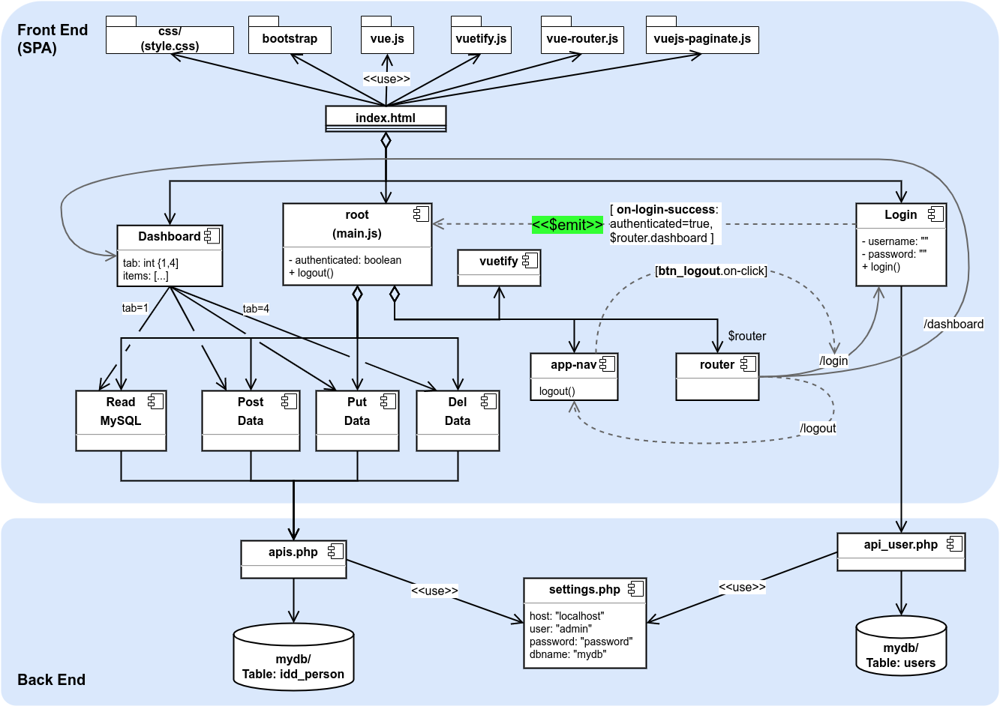

Week 9: Single Page Application
--------------------------------

# Design
Refer to `docs/w09-design.drawio` for a design diagram.

## Set up
The following set-up assumes that you run the application on a web server with MySQL database support. This could be your localhost web server (e.g. XAMPP) or the one on Mercury.

1. Make sure that your web server supports: PHP and MySQL

2. In MySQL, create two database tables by executing the script: `resources/db_person.sql`

3. Open `settings.php` and change the `dbConfig` array according to your MySQL database credentials (either on localhost or on Mercury)

4. Upload the entire `w09` folder to your web server

5. Run the app by pointing your browser to the `.../w09` folder path to run, e.g. `http://localhost/cos30043/w09`

## Login
Use the following application credentials to log into the app:
  - user: `admin` 
  - password: `hellovue`

You can change these credentials in the database table named `users`.

## Tasks
1. Dashboard:
   1. Add "Welcome <user-name>" to the top-right corner
2. Tab View: 
   1. add a Refresh button to obtain the people list again from the server and display it
   2. add the Search function to allow user search for person
3. UI/UX:
   1. beautify the dashboard to use a consistent color scheme
4. App architecture design:
   1. update your the code so that you can separate the frontend (VueJS) app from your backend (PHP) app. For example, the frontend app runs on your localhost server while the backend app runs on Mercury
5. Alternative backend design: 
   1. How would you make the RESTful/JSON backend app (from last week) to work with this app (i.e. replacing the PHP app)?

## References
1. `$root`: https://vuejs.org/api/component-instance.html#root 
   - Vue root instance of the current component
2. Component events: https://vuejs.org/guide/components/events.html

3. Navigation with Vue-router:
- `$router.replace()`: https://router.vuejs.org/guide/essentials/navigation.html#replace-current-location

1. Stats about frontend frameworks: 
  - Google trends: https://trends.google.com/
  - "angular jobs", "react jobs", "vuejs jobs"